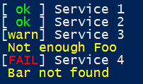
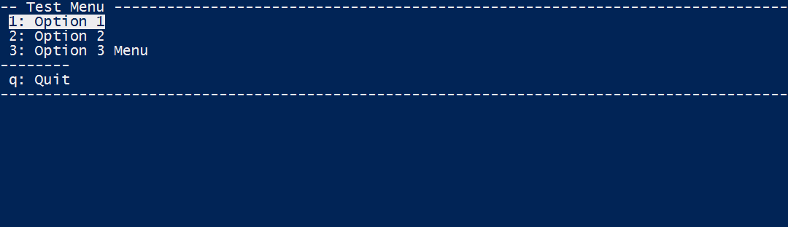
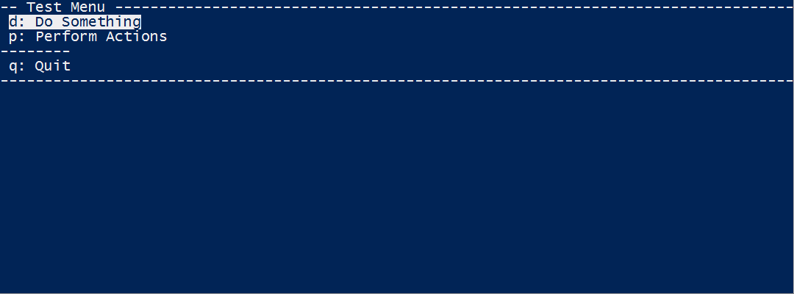

Title: Announcing SLMenu
SubTitle: SLMenu - A powershell text ui library
Published: 2016-04-16
----
I am happy to announce the open sourcing of a project I have been using at work
in one form or another for the last few years, [SLMenu](https://github.com/SteveLowe/SLMenu).

SLMenu is a set of functions intended to help make text user interfaces in powershell (v3 or above).

It can be used to create menus:  

The menu can be used to return data (any Object) or execute a scriptblock on selection.

And can show status of things:  

See the [github repo](https://github.com/SteveLowe/SLMenu) for more detailed information.

Examples
--------

